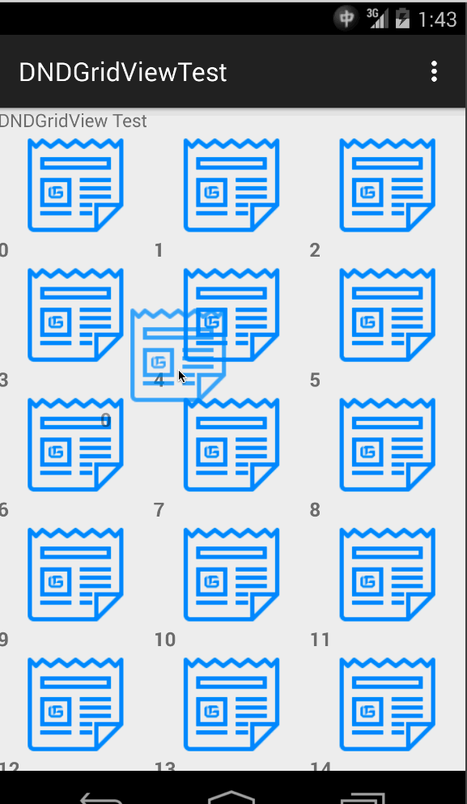

# DNDGridView

Drag & Drop GridView on Android.

## Poject Components

DNDGridView provide below components.

* DNDGridView, which is a customized GridView.
* DNDAdapter, most of the drag & drop part is done in this file.
* DNDViewHolder, provide ViewHolder which can save current view's position.

## Project Structure
After checkout this repo, you will get a sample project and the DNDGridView module is located in `dndgridview` folder.
## Usage

To use DNDGridView, you need to add it in layout xml file or Java code.

	<sun.bob.dndgridview.DNDGridView
        android:layout_width="match_parent"
        android:layout_height="0dp"
        android:layout_weight="1.0"
        android:id="@+id/id_dndgridview"/>
        
DNDGridView has some restrictions which currently I didn't find a better way to bypass. 

First, DNDGridView widget only accept DNDAdapter as it's adapter. It will check adapter's type while calling setAdapter. If it's not an instance of DNDAdapter, it will throw a big IllegalArgumentException.

So, to use drag & drop feature, you need to extend DNDAdapter using your own adapter. You can using sample project as reference.

In short word, you must extends DNDAdapter, you MUST implement `getView` function, you MUST call `setUpDragNDrop` after you are done with your item view.

		    ((DNDGridView) findViewById(R.id.id_dndgridview)).setAdapter(new DNDAdapter(this, R.layout.dnd_item) {
            ArrayList data;
            {
                data = new ArrayList();
                for (int i = 0; i < 100; i++) {
                    data.add("" + i);
                }
                this.setCustomArray(data);

            }
            @Override
            public View getView(int posistion, View convertView, ViewGroup parent) {
                View ret = convertView;
                ViewHolder tag;
                if (convertView == null) {
                    ret = View.inflate(getContext(), R.layout.dnd_item, null);
                    tag = new ViewHolder(posistion);
                    tag.imageView = (ImageView) ret.findViewById(R.id.id_imageview);
                    tag.textView = (TextView) ret.findViewById(R.id.id_textview);
                    ret.setTag(tag);
                } else {
                    tag = (ViewHolder) ret.getTag();
                }
                tag.imageView.setImageResource(R.drawable.img0);
                tag.textView.setText((String) data.get(posistion));
                setUpDragNDrop(posistion,ret);
                return ret;
            }
        });

Second, DNDGridView require a DNDViewHolder as view holder. So, if you are using your own viewholder, please extend DNDViewHolder to get this module working. If you didn't specified a view holder, DNDAdapter will automaticlly add one for you.

In short word, your view holder MUST extends `DNDViewHolder`

	class ViewHolder extends DNDViewHolder {
    	public ViewHolder(int posistion){
        	super(posistion);
    	}
    	Object data;
    	ImageView imageView;
    	TextView textView;
	}
	
## Screenshot
Picture file size is 1.6MB so you may want to get yourself a cup of coffee while it's loading.
